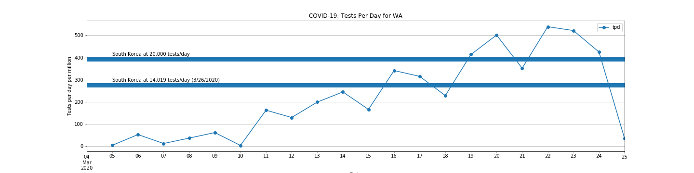

# COVID-19 Data Analysis

Providing COVID-19 data of a type in a format I am particularly interested.  The idea is to keep updating from on-line data sources day-by-day.

For now, I am focused on comparing US with other countries and US states with one-another.  For this purpose, I will work to normalize the data on a per-capita basis.

## Tests vs. State

## Cumulative Test Totals by Date : USA

## Cumulative Test Totals by Date : WA (normalized)

I plotted the data for Washington State normalized to tests per capita per day.  I also plotted data for South Korea based, population 51 million at 20,000 tests per day, as well as the number of tests that South Korea conducted yesterday (3/26/2020).

 I plotted the data this way because I had read [an article on CNN.com](https://www.cnn.com/2020/03/25/politics/coronavirus-testing-trump-south-korea-fact-check/index.html) challenging Dr. Birx statement of 3/24/2020 that we had done more testing in the last 8 days than  then South Korea did in 8 mweeks.  This statement was subsequently repeated by Trump - probably with flare and has been widely challenged by fact-checkers based on the fact that the US has a much larger population.
 
But anyway, South Korea is sometimes put forwad as having done an exemplery job at testing.  I just wanted to see how the US compared.  The CNN article stated that South Korea had conducted 20,000 tests per day at their peak, so I plotted that level on the chart.  Not having the full South Korean data in-hand, I just added what I could easily locate and put it on the chart for comparison purposes.  

Sometime soon, I'll locate the full historical data for South Korea and can make a more useful plot.  But this is interesting as a reference point.  It appears that at least for the state of Washington the per-capita test rates are comparable to those being performed in Washington State over the last week.

Here's a similar referenced plot for the entire USA.

And here's the same plot for Some of the other states.

From these plots it would appear that in the last week, the US has moved into the same league as South Korea in it's ability to do testing. 

---